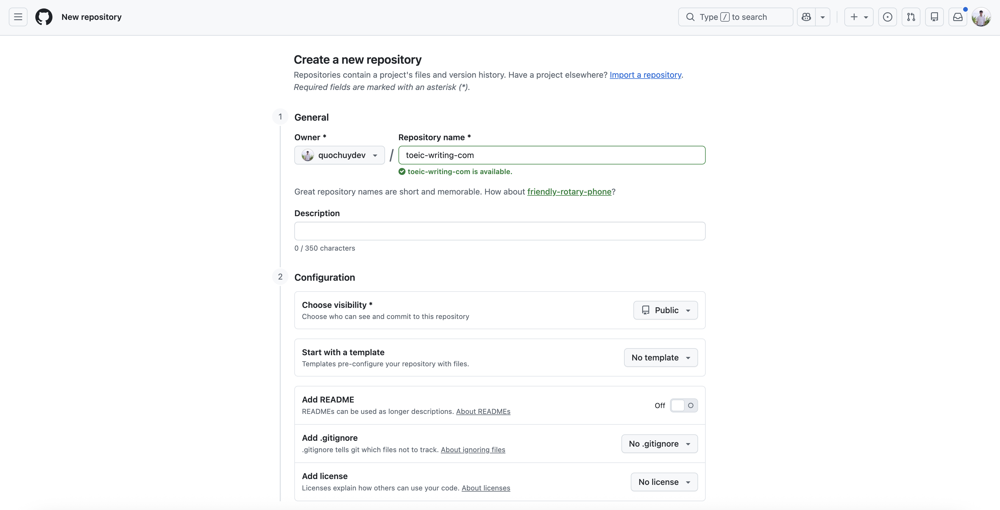
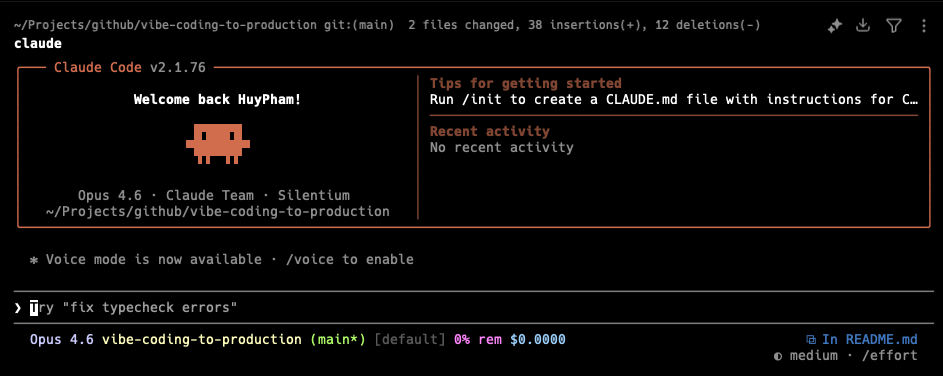
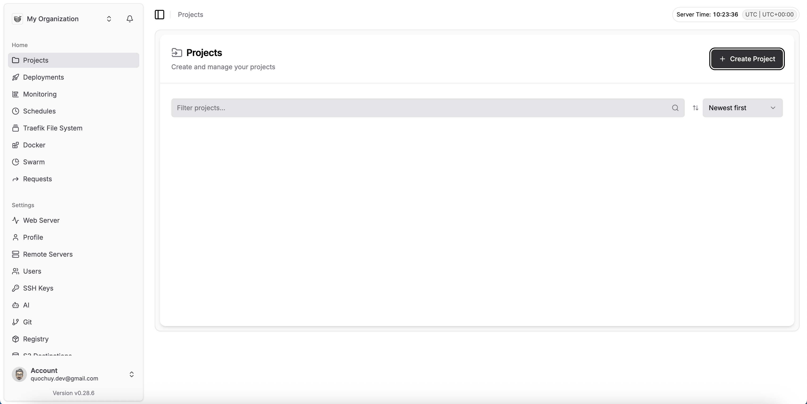
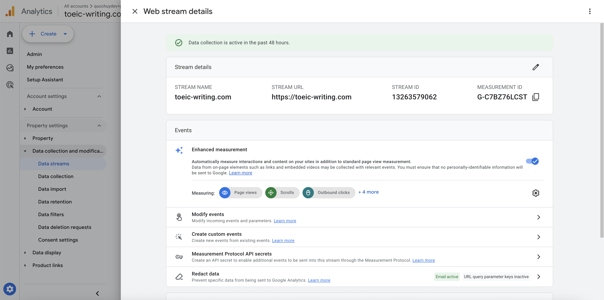

# Vibe Coding to Production

🇺🇸 [English](README.md) | 🇨🇳 [中文](README-zh.md) | 🇻🇳 [Tiếng Việt](README-vi.md) | 🇪🇸 [Español](README-es.md) | 🇩🇪 [Deutsch](README-de.md)

Hướng dẫn từng bước hoàn chỉnh dành cho **người không biết lập trình** để xây dựng một trang web từ đầu và triển khai lên môi trường production bằng cách viết code hỗ trợ bởi AI (vibe coding) với Claude Code.

Sau khi hoàn thành hướng dẫn này, bạn sẽ có:

- Một trang web Next.js hoạt động đầy đủ
- Tích hợp thanh toán Stripe
- Triển khai lên máy chủ thực tế với Dokploy
- Cài đặt theo dõi Google Analytics

Không yêu cầu kinh nghiệm lập trình trước đó. Bắt đầu thôi.

---

## Mục Lục

1. [Tạo tài khoản & kho lưu trữ GitHub](#1-tạo-tài-khoản--kho-lưu-trữ-github)
2. [Cài đặt Git, Node.js & Claude Code](#2-cài-đặt-git-nodejs--claude-code)
3. [Clone kho lưu trữ GitHub của bạn](#3-clone-kho-lưu-trữ-github-của-bạn)
4. [Thiết lập Claude Code](#4-thiết-lập-claude-code)
5. [Xây dựng trang web với Next.js](#5-xây-dựng-trang-web-với-nextjs)
6. [Thiết lập thanh toán Stripe](#6-thiết-lập-thanh-toán-stripe)
7. [Thiết lập máy chủ DigitalOcean](#7-thiết-lập-máy-chủ-digitalocean)
8. [Cài đặt & cấu hình Dokploy](#8-cài-đặt--cấu-hình-dokploy)
9. [Triển khai trang web của bạn](#9-triển-khai-trang-web-của-bạn)
10. [Thiết lập Google Analytics](#10-thiết-lập-google-analytics)

---

## 1. Tạo tài khoản & kho lưu trữ GitHub

GitHub là nơi lưu trữ code trang web của bạn. Hãy coi nó như một thư mục đám mây cho dự án, đồng thời theo dõi mọi thay đổi bạn thực hiện.

### Tạo tài khoản GitHub

1. Truy cập [github.com](https://github.com)
2. Nhấn **Sign up**
3. Nhập email, tạo mật khẩu và chọn tên người dùng
4. Hoàn thành xác minh và nhấn **Create account**
5. Kiểm tra email và xác minh tài khoản

### Tạo kho lưu trữ mới

Kho lưu trữ (hay "repo") giống như một thư mục dự án trên GitHub.

1. Sau khi đăng nhập, nhấn biểu tượng **+** ở góc trên bên phải
2. Nhấn **New repository**
3. Điền thông tin:
   - **Repository name**: chọn tên cho dự án (ví dụ: `my-website`)
   - **Description**: tùy chọn, thêm mô tả ngắn
   - **Public** hoặc **Private**: chọn Private nếu bạn không muốn người khác thấy code
   - Tích vào **Add a README file**
4. Nhấn **Create repository**



5. Bạn đã có kho lưu trữ! Sao chép URL từ trình duyệt — trông như thế này: `https://github.com/your-username/my-website`

---

## 2. Cài đặt Git, Node.js & Claude Code

Bạn cần ba công cụ trên máy tính: Git (để quản lý code), Node.js (để chạy trang web cục bộ) và Claude Code (trợ lý lập trình AI của bạn).

### Cài đặt Git

Git là công cụ kết nối máy tính của bạn với GitHub.

**Trên Mac:**

1. Mở ứng dụng **Terminal** (tìm kiếm "Terminal" trong Spotlight bằng Cmd + Space)
2. Gõ lệnh sau và nhấn Enter:
   ```bash
   git --version
   ```
3. Nếu Git chưa được cài đặt, một cửa sổ bật lên sẽ yêu cầu bạn cài đặt Command Line Tools — nhấn **Install**
4. Chờ quá trình cài đặt hoàn tất

**Trên Windows:**

1. Truy cập [git-scm.com](https://git-scm.com)
2. Tải về trình cài đặt và chạy nó
3. Nhấn **Next** qua tất cả các tùy chọn mặc định và hoàn tất cài đặt
4. Mở **Git Bash** từ menu Start (dùng cái này thay vì command prompt thông thường)

### Cấu hình Git

Sau khi cài đặt, cho Git biết bạn là ai. Mở Terminal (Mac) hoặc Git Bash (Windows) và chạy:

```bash
git config --global user.name "Your Name"
git config --global user.email "your-email@example.com"
```

Dùng cùng email bạn đã đăng ký GitHub.

### Cài đặt Node.js

Node.js cho phép bạn chạy trang web trên máy tính trong quá trình phát triển.

1. Truy cập [nodejs.org](https://nodejs.org)
2. Tải phiên bản **LTS** (phiên bản có ghi "Recommended for most users")
3. Chạy trình cài đặt và làm theo các tùy chọn mặc định
4. Xác minh đã cài đặt thành công bằng cách mở Terminal và chạy:
   ```bash
   node --version
   npm --version
   ```
   Cả hai lệnh đều phải hiển thị số phiên bản.

### Cài đặt Claude Code

Claude Code là trợ lý AI chạy trong terminal và viết code cho bạn.

1. Mở Terminal và chạy:
   ```bash
   npm install -g @anthropic-ai/claude-code
   ```
2. Xác minh đã cài đặt thành công:
   ```bash
   claude --version
   ```

---

## 3. Clone kho lưu trữ GitHub của bạn

"Clone" có nghĩa là tải kho lưu trữ GitHub về máy tính để bạn có thể làm việc cục bộ.

1. Mở Terminal
2. Điều hướng đến nơi bạn muốn lưu dự án. Ví dụ, để đặt trong thư mục "Projects":
   ```bash
   mkdir -p ~/Projects
   cd ~/Projects
   ```
3. Clone kho lưu trữ (thay bằng URL thực của bạn từ Bước 1):
   ```bash
   git clone https://github.com/your-username/my-website.git
   ```
4. Vào thư mục dự án:
   ```bash
   cd my-website
   ```

Bạn đang ở trong thư mục dự án và sẵn sàng bắt đầu xây dựng.

---

## 4. Thiết lập Claude Code

### Mua gói Claude

Claude Code yêu cầu API key của Anthropic hoặc gói đăng ký Claude.

**Tùy chọn A: API Key của Anthropic (Trả theo lượng dùng)**

1. Truy cập [console.anthropic.com](https://console.anthropic.com)
2. Đăng ký tài khoản
3. Vào **Settings** > **API Keys**
4. Nhấn **Create Key** và sao chép nó
5. Thêm thông tin thanh toán trong **Settings** > **Billing** và nạp tiền (bắt đầu với $10–20)

**Tùy chọn B: Gói Claude Max (Dùng không giới hạn)**

1. Truy cập [claude.ai](https://claude.ai)
2. Đăng ký và đăng ký gói **Max** ($100/tháng) bao gồm quyền sử dụng Claude Code

### Kết nối Claude Code với tài khoản của bạn

1. Mở Terminal và điều hướng đến thư mục dự án:
   ```bash
   cd ~/Projects/my-website
   ```
2. Khởi động Claude Code:
   ```bash
   claude
   ```
3. Lần đầu khởi chạy, nó sẽ yêu cầu bạn xác thực:
   - Nếu dùng **API Key**: nó sẽ nhắc bạn nhập key
   - Nếu dùng **gói Claude**: nó sẽ mở cửa sổ trình duyệt để đăng nhập
4. Làm theo hướng dẫn trên màn hình để hoàn tất xác thực



Bây giờ bạn đã sẵn sàng để vibe code! Claude Code sẽ đọc các file dự án và giúp bạn xây dựng trang web.

---

## 5. Xây dựng trang web với Next.js

Next.js là framework phổ biến để xây dựng các trang web hiện đại. Bạn không cần phải hiểu nó — Claude Code sẽ thiết lập mọi thứ cho bạn.

### Khởi tạo dự án

Đảm bảo bạn đang trong thư mục dự án, sau đó khởi động Claude Code:

```bash
cd ~/Projects/my-website
claude
```

Nhập prompt sau:

```
Set up a new Next.js project in the current directory with TypeScript, Tailwind CSS,
and the App Router. Use the latest version of Next.js. Keep the default configuration
simple and clean.
```

Claude Code sẽ tạo tất cả các file cần thiết. Khi hoàn tất, bạn có thể xem trước trang web cục bộ:

```bash
npm run dev
```

Mở trình duyệt và truy cập `http://localhost:3000` để xem trang web của bạn.


### Thiết kế giao diện trang web

Bây giờ hãy cho Claude Code biết bạn muốn trang web trông như thế nào. Dưới đây là một số prompt mẫu bạn có thể sử dụng:

**Cho trang landing page:**

```
Create a modern landing page with:
- A navigation bar with the logo "MyBrand" on the left and links to
  Home, Features, Pricing, and Contact on the right
- A hero section with a big headline "Build Something Amazing",
  a subtitle, and a call-to-action button
- A features section with 3 cards showing icons, titles, and descriptions
- A footer with copyright info and social media links
Make it look professional and modern with a clean design.
```

**Cho trang web nhiều trang:**

```
Create these pages for my website:
- Home page: landing page with hero, features, and testimonials
- About page: company story, team section with photos
- Pricing page: 3 pricing tiers (Basic, Pro, Enterprise) with feature comparison
- Contact page: a contact form with name, email, and message fields
Add a consistent navigation bar and footer across all pages.
```

**Cho trang sản phẩm SaaS:**

```
Build a SaaS landing page for a project management tool called "TaskFlow":
- Hero section with a product screenshot mockup
- Problem/solution section
- Feature showcase with 6 features in a grid
- Social proof section with customer logos
- Pricing section with monthly/yearly toggle
- FAQ section with expandable answers
- CTA section at the bottom
Use a blue and white color scheme.
```

**Để tinh chỉnh thiết kế:**

```
Make the hero section taller, change the background to a gradient from blue to purple,
and make the headline text larger and bolder.
```

```
Add smooth scroll animations so elements fade in as the user scrolls down the page.
```

```
Make the website fully responsive so it looks great on mobile phones and tablets.
```

### Mẹo khi Vibe Coding

- **Hãy cụ thể**: bạn cung cấp càng nhiều chi tiết, kết quả càng tốt
- **Lặp lại**: nếu có điều gì đó không đúng, hãy mô tả những gì cần thay đổi
- **Tham chiếu các trang bạn thích**: "Make it look like the Stripe homepage" cho Claude Code một điểm tham chiếu
- **Yêu cầu sửa lỗi**: nếu bạn thấy lỗi, chỉ cần mô tả — "The navigation menu is overlapping the hero section on mobile, please fix it"

---

## 6. Thiết lập thanh toán Stripe

Stripe cho phép bạn nhận thanh toán trên trang web. Bạn sẽ tạo tài khoản Stripe và sau đó dùng Claude Code để thêm chức năng thanh toán.

### Tạo tài khoản Stripe

1. Truy cập [stripe.com](https://stripe.com)
2. Nhấn **Start now** và tạo tài khoản
3. Sau khi đăng nhập, bạn sẽ ở **chế độ Test** theo mặc định (bạn có thể thấy công tắc chuyển đổi trong dashboard) — đây là môi trường hoàn hảo để xây dựng; không có tiền thật nào bị tính
4. Vào **Developers** > **API keys**
5. Bạn sẽ thấy hai key:
   - **Publishable key**: bắt đầu bằng `pk_test_...`
   - **Secret key**: bắt đầu bằng `sk_test_...` (nhấn để hiển thị)


6. Giữ trang này mở — bạn sẽ cần cả hai key

### Tạo sản phẩm trong Stripe

1. Trong Stripe Dashboard, vào **Product catalog** > **Add product**
2. Tạo các gói giá:
   - Name: "Basic Plan"
   - Price: $9/month (hoặc bất kỳ mức giá nào bạn muốn)
   - Nhấn **Save product**
3. Lặp lại cho các gói khác (Pro, Enterprise, v.v.)
4. Với mỗi sản phẩm, sao chép **Price ID** (bắt đầu bằng `price_...`) — bạn sẽ cần những ID này

### Thêm Stripe vào trang web

Khởi động Claude Code trong thư mục dự án và dùng các prompt sau:

**Thiết lập tích hợp Stripe:**

```
Add Stripe payment integration to my Next.js project:
1. Install the Stripe packages (stripe and @stripe/stripe-js)
2. Create a .env.local file for my Stripe API keys with these placeholders:
   NEXT_PUBLIC_STRIPE_PUBLISHABLE_KEY=pk_test_xxx
   STRIPE_SECRET_KEY=sk_test_xxx
3. Create an API route at /api/checkout that creates a Stripe checkout session
4. The checkout should redirect to a /success page after payment
   and a /cancel page if they cancel
```

**Thêm trang pricing với thanh toán:**

```
Create a pricing page with 3 tiers:
- Basic: $9/month - 5 projects, basic support
- Pro: $29/month - unlimited projects, priority support
- Enterprise: $99/month - everything in Pro plus dedicated account manager

Each tier should have a "Get Started" button that redirects to Stripe Checkout.
Use these Stripe Price IDs:
- Basic: price_xxxxx (replace with your real price ID)
- Pro: price_xxxxx
- Enterprise: price_xxxxx
```

**Thêm key Stripe thực của bạn:**

```
Update the .env.local file with my real Stripe keys:
NEXT_PUBLIC_STRIPE_PUBLISHABLE_KEY=pk_test_your_actual_key_here
STRIPE_SECRET_KEY=sk_test_your_actual_key_here
```

### Kiểm tra thanh toán

1. Chạy trang web cục bộ bằng `npm run dev`
2. Vào trang pricing và nhấn nút mua hàng
3. Trên trang thanh toán Stripe, dùng số thẻ test: `4242 4242 4242 4242`
   - Ngày hết hạn: bất kỳ ngày nào trong tương lai
   - CVC: bất kỳ 3 chữ số nào
4. Hoàn tất giao dịch — bạn sẽ được chuyển hướng đến trang thành công
5. Kiểm tra Stripe Dashboard trong **Payments** để xem giao dịch test


### Chuyển sang thanh toán thực

Khi bạn sẵn sàng nhận thanh toán thực:

1. Hoàn tất thiết lập tài khoản Stripe (thông tin doanh nghiệp, tài khoản ngân hàng)
2. Chuyển từ **chế độ Test** sang **chế độ Live** trong Stripe Dashboard
3. Sao chép live API key (chúng bắt đầu bằng `pk_live_` và `sk_live_`)
4. Cập nhật `.env.local` với live key

---

## 7. Thiết lập máy chủ DigitalOcean

Bạn cần một máy chủ để lưu trữ trang web để bất kỳ ai cũng có thể truy cập trên internet.

### Tạo tài khoản DigitalOcean

1. Truy cập [digitalocean.com](https://www.digitalocean.com)
2. Nhấn **Sign up** và tạo tài khoản
3. Thêm phương thức thanh toán (thẻ tín dụng hoặc PayPal)
4. Bạn có thể nhận $200 tín dụng miễn phí trong 60 ngày với tư cách người dùng mới

### Tạo máy chủ (Droplet)

1. Sau khi đăng nhập, nhấn **Create** > **Droplets**
2. Chọn các cài đặt sau:
   - **Region**: chọn nơi gần nhất với người dùng của bạn (ví dụ: San Francisco, New York, London)
   - **Image**: chọn **Ubuntu 22.04 (LTS)** hoặc Ubuntu LTS mới nhất
   - **Size**: chọn **Basic** > **Regular** > **$12/mo** (2 GB RAM / 1 CPU) — đủ để bắt đầu
   - **Authentication**: chọn **Password** và đặt mật khẩu root mạnh (lưu ở nơi an toàn!)
3. Nhấn **Create Droplet**
4. Chờ khoảng 60 giây để khởi động
5. Sao chép **địa chỉ IP** được hiển thị (ví dụ: `164.90.xxx.xxx`) — bạn sẽ cần nó


---

## 8. Cài đặt & cấu hình Dokploy

Dokploy là công cụ miễn phí, mã nguồn mở giúp triển khai trang web dễ dàng như nhấn nút. Nó giống như phiên bản đơn giản hơn của Vercel hoặc Heroku chạy trên máy chủ của chính bạn.

### Cài đặt Dokploy trên máy chủ

1. Mở Terminal trên máy tính
2. Kết nối với máy chủ qua SSH:
   ```bash
   ssh root@your-server-ip-address
   ```
3. Gõ `yes` khi được hỏi về fingerprint, sau đó nhập mật khẩu máy chủ
4. Sau khi kết nối, chạy lệnh cài đặt Dokploy:
   ```bash
   curl -sSL https://dokploy.com/install.sh | sh
   ```
5. Chờ quá trình cài đặt hoàn tất (mất vài phút)
6. Khi xong, nó sẽ hiển thị URL như `http://your-server-ip:3000`

### Thiết lập Dokploy

1. Mở trình duyệt và truy cập `http://your-server-ip:3000`
2. Bạn sẽ thấy màn hình thiết lập Dokploy
3. Tạo tài khoản quản trị:
   - Nhập email của bạn
   - Tạo mật khẩu
   - Nhấn **Register**
4. Bạn đang ở trong Dokploy dashboard


### Kết nối Dokploy với GitHub

Điều này cho phép Dokploy tự động kéo code từ GitHub của bạn.

1. Trong Dokploy, vào **Settings** (biểu tượng bánh răng) > **Git Providers**
2. Nhấn **Add GitHub**
3. Bạn sẽ được chuyển hướng đến GitHub — nhấn **Authorize** để cấp quyền truy cập cho Dokploy
4. Chọn kho lưu trữ nào Dokploy có thể truy cập:
   - Chọn **Only select repositories** và chọn kho lưu trữ trang web của bạn
   - Nhấn **Install & Authorize**
5. Bạn sẽ được chuyển hướng trở lại Dokploy — kết nối đã hoạt động


---

## 9. Triển khai trang web của bạn

### Đẩy code lên GitHub

Trước khi triển khai, bạn cần đẩy code lên GitHub. Quay lại Terminal cục bộ (không phải phiên SSH với máy chủ) và thực hiện:

1. Mở Terminal và vào thư mục dự án:
   ```bash
   cd ~/Projects/my-website
   ```
2. Thêm tất cả file vào Git:
   ```bash
   git add .
   ```
3. Tạo commit (ảnh chụp nhanh code của bạn):
   ```bash
   git commit -m "Initial website build"
   ```
4. Đẩy lên GitHub:
   ```bash
   git push origin main
   ```

Nếu đây là lần đẩy đầu tiên, Git có thể yêu cầu bạn đăng nhập vào GitHub. Làm theo hướng dẫn.

**Mẹo:** Bạn cũng có thể làm điều này qua Claude Code:

```
Commit all changes with the message "Initial website build" and push to GitHub.
```

### Tạo ứng dụng trong Dokploy

1. Trong Dokploy dashboard, nhấn **Projects** trong thanh bên



2. Nhấn **Create Project** và đặt tên (ví dụ: "My Website")
3. Trong dự án, nhấn **Create Service** > **Application**
4. Cấu hình ứng dụng:
   - **Name**: đặt tên (ví dụ: "web")
   - **Source**: chọn **GitHub**
   - **Repository**: chọn kho lưu trữ trang web của bạn
   - **Branch**: `main`
   - **Build Type**: chọn **Nixpacks** (tự động phát hiện loại dự án)
5. Nhấn **Save**

### Thiết lập biến môi trường

Trang web của bạn cần các key Stripe để hoạt động trong môi trường production.

1. Trong cài đặt ứng dụng trong Dokploy, vào tab **Environment**
2. Thêm các biến môi trường (mỗi dòng một biến):
   ```
   NEXT_PUBLIC_STRIPE_PUBLISHABLE_KEY=pk_live_your_key
   STRIPE_SECRET_KEY=sk_live_your_key
   ```
3. Nhấn **Save**

### Thiết lập tên miền (Tùy chọn nhưng khuyến nghị)

Nếu bạn có tên miền:

1. Trong Dokploy, vào ứng dụng của bạn > tab **Domains**
2. Nhấn **Add Domain**
3. Nhập tên miền (ví dụ: `www.mywebsite.com`)
4. Bật **HTTPS** (chứng chỉ SSL miễn phí qua Let's Encrypt)
5. Nhấn **Save**
6. Trong nhà đăng ký tên miền (nơi bạn mua tên miền), thêm bản ghi DNS:
   - **Type**: A
   - **Name**: `@` (hoặc `www`)
   - **Value**: địa chỉ IP máy chủ của bạn
   - **TTL**: 3600

### Triển khai

1. Trong Dokploy, vào ứng dụng và nhấn **Deploy**
2. Xem nhật ký build — Dokploy sẽ:
   - Kéo code từ GitHub
   - Cài đặt các dependency
   - Build trang web Next.js của bạn
   - Khởi động nó
3. Sau khi build hoàn tất, trang web của bạn đã trực tuyến!


### Tự động triển khai khi đẩy code

Dokploy có thể tự động triển khai mỗi khi bạn đẩy code mới lên GitHub:

1. Trong cài đặt ứng dụng, vào tab **General**
2. Bật **Auto Deploy**
3. Bây giờ, mỗi khi bạn đẩy code lên GitHub, Dokploy tự động build lại và triển khai

### Quy trình đầy đủ: Thực hiện thay đổi và triển khai

Đây là quy trình hàng ngày để cập nhật trang web:

1. Mở Terminal, điều hướng đến dự án và khởi động Claude Code:
   ```bash
   cd ~/Projects/my-website
   claude
   ```
2. Cho Claude Code biết cần thay đổi gì:
   ```
   Change the hero headline to "Welcome to the Future" and update the
   background color to dark blue.
   ```
3. Xem trước cục bộ tại `http://localhost:3000` (chạy `npm run dev`)
4. Khi hài lòng với các thay đổi, commit và đẩy:
   ```bash
   git add .
   git commit -m "Update hero section"
   git push origin main
   ```
5. Dokploy tự động triển khai các thay đổi của bạn. Xong!

---

## 10. Thiết lập Google Analytics

Google Analytics cho phép bạn xem có bao nhiêu người truy cập trang web, họ đến từ đâu và họ xem những trang nào.

### Tạo tài khoản Google Analytics

1. Truy cập [analytics.google.com](https://analytics.google.com)
2. Nhấn **Start measuring**
3. Điền thông tin tài khoản:
   - **Account name**: tên của bạn hoặc tên doanh nghiệp
   - Nhấn **Next**
4. Tạo property:
   - **Property name**: tên trang web của bạn
   - Chọn múi giờ và tiền tệ
   - Nhấn **Next**
5. Điền thông tin doanh nghiệp và nhấn **Create**
6. Chấp nhận điều khoản dịch vụ

### Lấy Measurement ID

1. Trong Google Analytics, vào **Admin** (biểu tượng bánh răng) > **Data Streams**
2. Nhấn **Add stream** > **Web**
3. Nhập URL trang web và tên luồng
4. Nhấn **Create stream**
5. Sao chép **Measurement ID** — trông như thế này: `G-XXXXXXXXXX`



### Thêm Google Analytics vào trang web

Khởi động Claude Code trong thư mục dự án và dùng prompt này:

```
Add Google Analytics to my Next.js project.
My Google Analytics Measurement ID is G-XXXXXXXXXX (replace with your real ID).
Set it up using the recommended approach with the Next.js Script component.
Add it to the root layout so it tracks all pages. Use an environment variable
called NEXT_PUBLIC_GA_MEASUREMENT_ID for the ID.
```

Sau đó thêm biến môi trường:

1. **Cục bộ**: thêm vào file `.env.local`:
   ```
   NEXT_PUBLIC_GA_MEASUREMENT_ID=G-XXXXXXXXXX
   ```
2. **Trên Dokploy**: thêm biến tương tự trong tab **Environment** của ứng dụng

### Xác minh đang hoạt động

1. Đẩy các thay đổi lên GitHub:
   ```bash
   git add .
   git commit -m "Add Google Analytics"
   git push origin main
   ```
2. Chờ Dokploy triển khai
3. Truy cập trang web trực tuyến của bạn
4. Vào Google Analytics > **Reports** > **Realtime**
5. Bạn sẽ thấy mình là người dùng đang hoạt động

---

## Tài liệu tham khảo nhanh: Các lệnh hữu ích

| Bạn muốn làm gì             | Lệnh                                            |
| ---------------------------- | ----------------------------------------------- |
| Mở Terminal                  | Cmd + Space, gõ "Terminal" (Mac)                |
| Vào thư mục dự án            | `cd ~/Projects/my-website`                      |
| Khởi động Claude Code        | `claude`                                        |
| Chạy trang web cục bộ        | `npm run dev`                                   |
| Dừng máy chủ cục bộ          | Nhấn `Ctrl + C` trong Terminal                  |
| Lưu thay đổi vào Git         | `git add .` rồi `git commit -m "your message"`  |
| Đẩy lên GitHub               | `git push origin main`                          |
| Kéo code mới nhất            | `git pull origin main`                          |
| Kiểm tra trạng thái dự án    | `git status`                                    |
| Kết nối với máy chủ          | `ssh root@your-server-ip`                       |

## Khắc phục sự cố

**"command not found: node"**
Node.js chưa được cài đặt đúng cách. Cài đặt lại từ [nodejs.org](https://nodejs.org).

**"command not found: claude"**
Chạy lại `npm install -g @anthropic-ai/claude-code`.

**Git yêu cầu username/password mỗi lần**
Thiết lập SSH key hoặc dùng GitHub CLI (`gh auth login`).

**Trang web hoạt động cục bộ nhưng không hoạt động sau khi triển khai**
Kiểm tra xem các biến môi trường đã được cài đặt trong tab Environment của Dokploy chưa.

**Thanh toán Stripe không hoạt động trong production**
Đảm bảo bạn đang dùng live key (không phải test key) và chúng đã được cài đặt trong biến môi trường của Dokploy.

**Build thất bại trên Dokploy**
Kiểm tra nhật ký build trong Dokploy để xem thông báo lỗi. Sao chép lỗi và dán vào Claude Code:

```
I'm getting this error when deploying: [paste error here]. How do I fix it?
```

---

## Tóm tắt

Đây là những gì bạn đã hoàn thành:

1. **GitHub** — code của bạn được lưu trữ và kiểm soát phiên bản
2. **Git + Node.js + Claude Code** — bộ công cụ phát triển cục bộ
3. **Next.js** — framework trang web hiện đại, nhanh chóng
4. **Stripe** — nhận thanh toán từ khách hàng
5. **DigitalOcean + Dokploy** — trang web của bạn đã trực tuyến trên internet
6. **Google Analytics** — bạn có thể theo dõi lượt truy cập và đo lường tăng trưởng

Điểm tuyệt vời của thiết lập này là quy trình về sau: mở Claude Code, mô tả những gì bạn muốn thay đổi, commit, đẩy lên và nó sẽ trực tuyến. Chúc bạn vibe coding vui vẻ!
